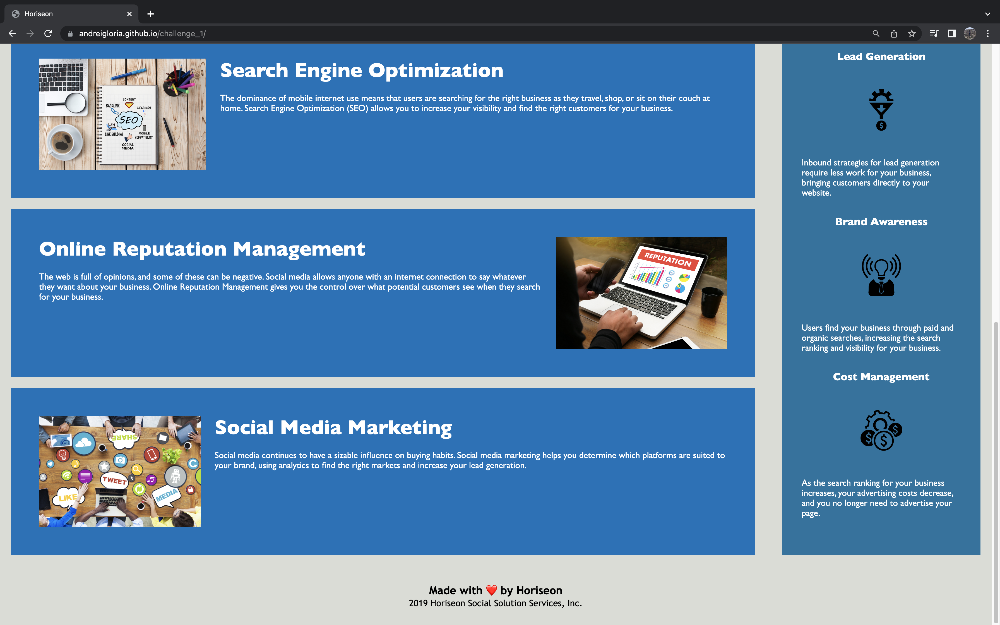

# Horiseon

## Description

The focus of this project is to modify a starter code to create an accessible website. This enables the website to be optimized for search engines like Google. It would also help the agency avoid litigation that could occur when people with disabilities cannot access the website. 

## Installation 

N/A

## Usage

## Credits

N/A

## License

N/A

